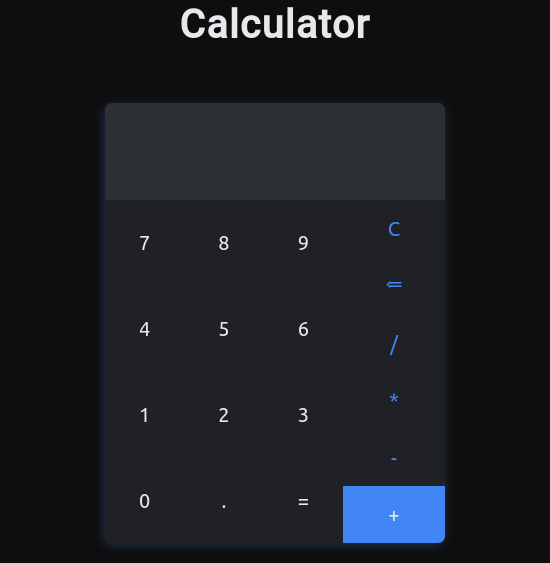

# Android-Calculator
This is an html,css and js project to emulate the Android's calculator

You can do the basic math operations like:

* Addition 
* Subtraction 
* Multiplication
* Division

It allows you to do operations with integers and decimal numbers.

